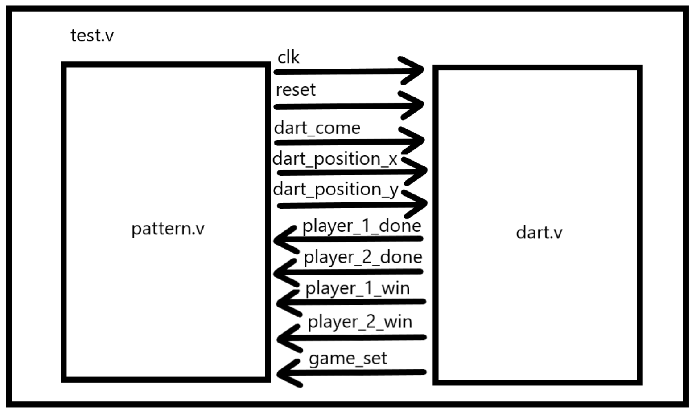
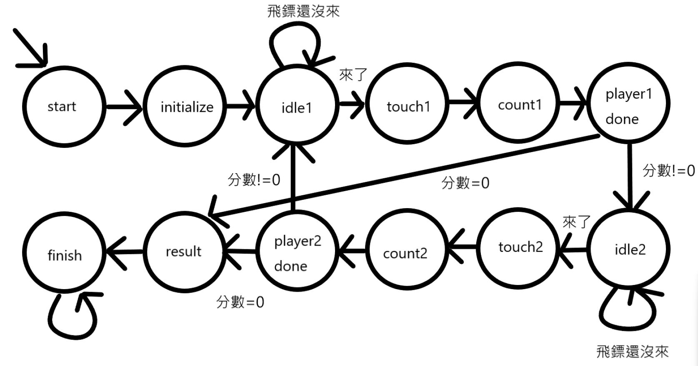

# Arcade Dart Board

由 Verilog 撰寫的電子飛鏢機，實作了 01 遊戲

成員：李勝維、吳奕霆

## 模組架構

- test.v - 連接 pattern 和飛鏢機
- pattern.v - test pattern
- dart.v - 飛鏢機

## 架構圖

- Dart come: 飛鏢是否來了
- Dart position x: 飛鏢在靶上 x 座標
- Dart position y: 飛鏢在靶上 y 座標
- Player 1 done: 玩家一的回合是否結束 包含偵測到飛鏢來了、計算分數
- Player 2 done: 玩家二的回合是否結束 包含偵測到飛鏢來了、計算分數
- Player 1 win: 判斷玩家一是否分數歸零
- Player 2 win: 判斷玩家二是否分數歸零
- Game set: 判斷是否有人分數歸零

## FSM 運行模式

- Start:start state
- Initialize: 把兩邊分數設為 501 分
- Idle1/2: 判斷 player1/2 飛鏢是不是來了
- Touch1/2: 用 LUT 查看該次丟擲為幾分
- Count1/2: 根據該次丟擲分數，計算剩餘分數，並判斷結果是否 <0
- Player1/2 done: 告知 pattern player1/2 的回合已結束，可以再來新的丟擲
- Result: 讓 pattern 輸出結果
- Finish: 等待 reset

